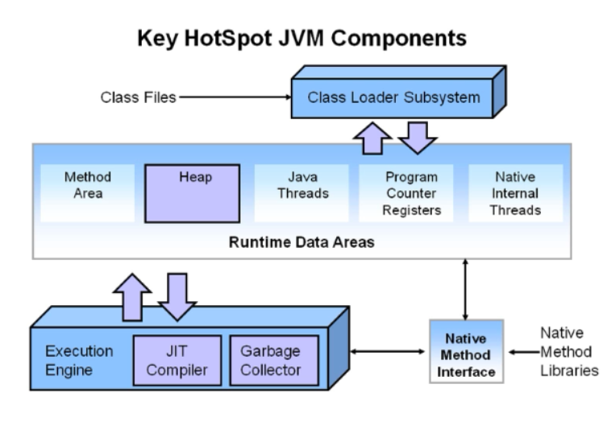
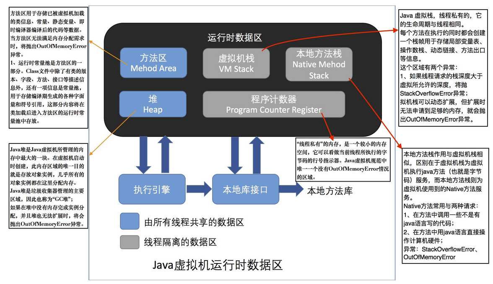
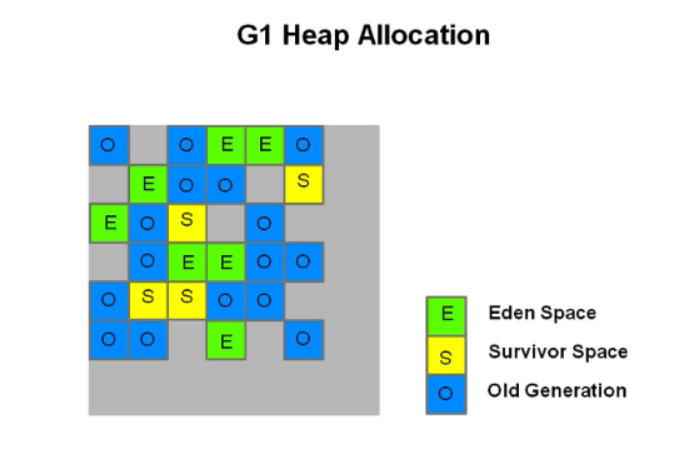
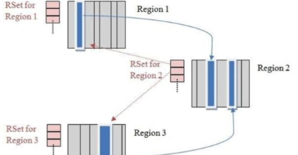
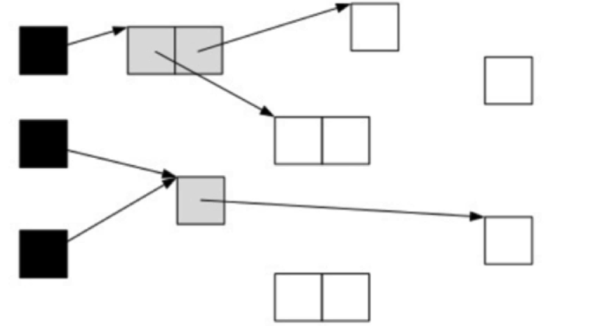
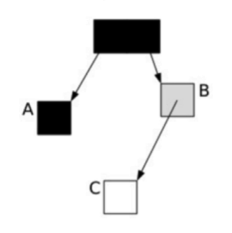
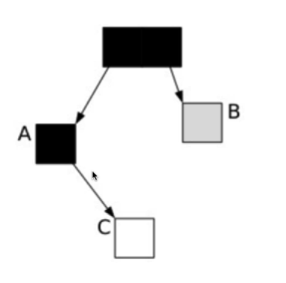
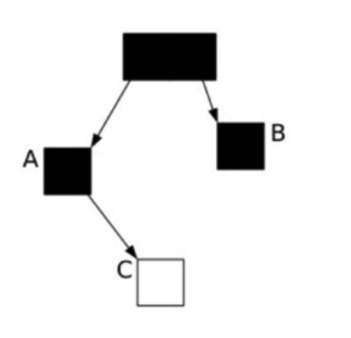

# Java内存结构

### java JVM内部结构
in




### java对象创建过程

```java
/**
 * Created BY poplar ON 2019/11/25
 * 关于Java对象创建的过程:
 * new关键字创建对象的3个步骤:
 * 1.在堆内存中创建出对象的实例。
 * 2.为对象的实例成员变量赋初值。
 * 3.将对象的引用返回
 * 指针碰撞(前提是堆中的空间通过一个指针进行分割，一侧是已经被占用的空间，另一侧是未被占用的空间)
 * 空闲列表(前提是堆内存空间中已被使用与未被使用的空间是交织在一起的，这时，虚拟机就需要通过一个列表来记录哪些空间是可以使用的，
 * 哪些空间是已被使用的，接下来找出可以容纳下新创建对象的且未被使用的空间，在此空间存放该对象，同时还要修改列表上的记录)
 * 对象在内存中的布局:
 * 1.对象头.
 * 2.实例数据(即我们在一个类中所声明的各项信息)
 * 3.对齐填充(可选) !
 * 引用访问对象的方式:
 * 1.使用句柄的方式。
 *    栈里面有一个引用,然后该引用指向一个句柄,该句柄分2部分 
 *        1.真正对象的指针 
 *        2. 方法区内class对象的元数据信息
 * 2.使用直接指针的方式。(效率高一些)
 *    栈里的引用直接指向数据对象分2部分
 *           1 实际的对象数据
 *           2 指针指向class对象的元数据信息    
 */
public class MemoryTest1 {
    public static void main(String[] args) {
        //-Xms 5m -Xmx 5m -XX:+HeapDumpOnOutOfMemoryError 设置jvm对空间最小和最大以及遇到错误时把堆存储文件打印出来
        //打开jvisualvm装在磁盘上的转存文件
        List<MemoryTest1> list = new ArrayList<>();
        while (true) {
            list.add(new MemoryTest1());
            System.gc();
        }
    }
}
```

### 虚拟机栈溢出测试

```java
/**
 * Created BY poplar ON 2019/11/25
 * 虚拟机栈溢出测试
 */
public class MemoryTest2 {

    private int length;

    public int getLength() {
        return length;
    }

    public void test() throws InterruptedException {
        length++;
        Thread.sleep(1);
        test();
    }

    public static void main(String[] args) {
        //测试调整虚拟机栈内存大小为：  -Xss160k，此处除了可以使用JVisuale监控程序运行状况外还可以使用jconsole
        MemoryTest2 memoryTest2 = new MemoryTest2();
        try {
            memoryTest2.test();
        } catch (Throwable e) {
            System.out.println(memoryTest2.getLength());//打印最终的最大栈深度为：2587
            e.printStackTrace();
        }
    }
}
```

###  元空间溢出测试

```java
/**
 * Created BY poplar ON 2019/11/26
 * 元空间内存溢出测试
 * 设置元空间大小：-XX:MaxMetaspaceSize=100m
 * 关于元空间参考：https://www.infoq.cn/article/java-permgen-Removed
 */
public class MemoryTest3 {
    public static void main(String[] args) {
        //使用动态代理动态生成类
        while (true) {
            Enhancer enhancer = new Enhancer();
            enhancer.setSuperclass(MemoryTest3.class);
            enhancer.setUseCache(false);
            enhancer.setCallback((MethodInterceptor) (obj, method, ags, proxy) -> proxy.invokeSuper(obj, ags));
            System.out.println("Hello World");
            enhancer.create();// java.lang.OutOfMemoryError: Metaspace
        }
    }
}
```

### JVM命令使用

```java
/**
 * Created BY poplar ON 2019/11/26
 * jmam命令的使用 -clstats<pid>进程id  to print class loader statistics
 * jmap -clstats 3740
 *
 * jstat -gc 3740
 *  S0C    S1C    S0U    S1U      EC       EU        OC         OU       MC     MU    CCSC   CCSU   YGC     YGCT    FGC    FGCT     GCT
 * 512.0  512.0   0.0    0.0   24064.0   9626.0   86016.0     1004.1   4864.0 3758.2 512.0  409.1     144    0.064   0      0.000    0.064
 * MC元空间总大小，MU元空间已使用的大小
 */
public class MemoryTest4 {
    public static void main(String[] args) {
        while (true)
            System.out.println("hello world");
    }
    //查看java进程id jps -l
    // 使用jcmd查看当前进程的可用参数：jcmd 10368 help
    //查看jvm的启动参数 jcmd 10368 VM.flags
   // 10368:-XX:CICompilerCount=3 -XX:InitialHeapSize=132120576 -XX:MaxHeapSize=2111832064 -XX:MaxNewSize=703594496
    // -XX:MinHeapDeltaBytes=524288 -XX:NewSize=44040192 -XX:OldSize=88080384 -XX:+UseCompressedClassPointers
    // -XX:+UseCompressedOops -XX:+UseFastUnorderedTimeStamps -XX:-UseLargePagesIndividualAllocation -XX:+UseParallelGC

}
```


### JVM常用命令

```
jcmd (从JDK 1. 7开始增加的命令)
1. jcmd pid VM.flags: 查看JVM的启动参数
2. jcmd pid help: 列出当前运行的Java进程可以执行的操作
3. jcmd pid helpJFR.dump:查看具体命令的选项
4. jcmd pid PerfCounter.print:看JVm性能相关的参数
5. jcmd pid VM.uptime:查有JVM的启动时长
6. jcmd pid GC.class_ histogram: 查看系统中类的统计信息
7. jcmd pid Thread.print: 查看线程堆栈信息
8. jcmd pid GC.heap dump filename 导出Heap dump文件， 导出的文件可以通过jvisualvm查看
9. jcmd pid VM.system_ properties:查看JVM的属性信息
10 jcmd pic VM.version : 当前虚拟机的版本号
11 jcmd pic VM.command_line : 虚拟机的启动命令行参数

jstack pid 线程相关堆栈信息

※重要 jmc(java mission control) 可以编程jmx等
jfr: java flight recorder

oql 对象查询语言

```

### JVM内存举例说明

```
   public void method() {
        Object object = new Object();

        /*生成了2部分的内存区域，1)object这个引用变量，因为
        是方法内的变量，放到JVM Stack里面,2)真正Object
        class的实例对象，放到Heap里面
        上述 的new语句一共消耗12个bytes, JVM规定引用占4
        个bytes (在JVM Stack)， 而空对象是8个bytes(在Heap)
        方法结束后，对应Stack中的变量马上回收，但是Heap
        中的对象要等到GC来回收、*/
    }
```


### JVM垃圾识别（根搜索算法( GC RootsTracing )）

- 在实际的生产语言中(Java、 C#等)，都是使用根搜索算法判定对象是否存活。

- 算法基本思路就是通过一系列的称为“GCRoots"的点作为起始进行向下搜索，当一个对象到GCRoots没有任何引用链( Reference Chain)相连，则证明此对象
  是不可用的

- 在Java语言中，GC Roots包括
  ●在VM栈(帧中的本地变量)中的引用
  ●方法区中的静态引用
  ●JNI (即一般说的Native方法) 中的引用

### 方法区

- Java虛拟机规范表示可以不要求虚拟机在这区实现GC,这区GC的“性价比”一般比较低
  在堆中，尤其是在新生代，常规应用进行1次GC一般可以回收70%~95%的空间，而方法区的GC效率远小于此
- 当前的商业JVM都有实现方法区的GC,主要回收两部分内容:废弃常量与无用类

- 主要回收两部分内容:废弃常量与无用类
- 类回收需要满足如下3个条件：
  - 该类所有的实例都已经被GC,也就是JVM中不存在该Class的任何实例
  - 加载该类的ClassL oader已经被GC
  - 该类对应的java.lang.Class对象没有在任何地方被引用，如不能在任何地方通过反射访问该类的方法

- 在大量使用反射、动态代理、CGLib等字节码框架、动态生成JSP以及OSGi这类频繁自定义Classloader的场景都需要JVM具备类卸载的支持以保证方法区不会溢出

### 垃圾判断与GC算法

- 垃圾判断的算法
  - 引用计数算法(Reference Counting)
  - 根搜索算法( GC RootsTracing )
  - 在实际的生产语言中(Java、 C#等)都是使用根搜索算法判定对象是否存活
  - 算法基本思路就是通过一一系列的称为GCRoots"的点作为起始进行向下搜索，当一个对象到GC Roots没有任何引用链(Reference Chain)相连，则证明此对象是不可用的

- 在Java语言中，可作为GC Roots的对象包括下面几种： 
  - 虚拟机栈（栈帧中的本地变量表）中引用的对象。 
  - 方法区中类静态属性引用的对象。 
  - 方法区中常量引用的对象。 
  - 本地方法栈中JNI（即一般说的Native方法）引用的对象


- 标记-清除算法(Mark Sweep)
- 标记-整理算法(Mark-Compact)
- 复制算法(Copying)
- 分代算法(Generational)

### 标记一清除算法(Mark-Sweep)

- 算法分为“标记”和“清除”两个阶段，
  首先标记出所有需要回收的对象，然后回
  收所有需要回收的对象

- 缺点
  效率问题，标记和清理两个过程效率都不高
  空间问题，
  标记清理之后会产生大量不连续的内存碎片，空间碎片太多可能会导致后续使用中无法找到足够的连续内存而提前触发另一次的垃圾搜集动作

- 效率不高，需要扫描所有对象。堆越大，GC越慢
  存在内存碎片问题。GC次数越多，碎片越为严重

  

  

### 复制(Copying) 搜集算法

- 将可用内存划分为两块，每次只使用其中的一块，当一半区内存用完了，仅将还存活
  的对象复制到另外一块上面，然后就把原来整块内存空间一次性清理掉，
- 这样使得每次内存回收都是对整个半区的回收，内存分配时也就不用考虑内存碎片等复杂情况，只要移动堆顶指针，按顺序分配内存就可以了，实现简单，运行高效。<font color=red>只是这种算法的代价是将内存缩小为原来的一半，代价高昂</font>

- 现在的商业虚拟机中都是用了这一种收集算法来回收新生代
- 将内存分为一块较大的eden空间和2块较少的survivor空间，每次使用eden和其中一块
  survivor, 当回收时将eden和survivor还存活的对象一次性拷 贝到另外一块survivor空间上，然后清理掉eden和用过的survivor
- Oracle Hotspot虚拟机默认eden和survivor的大小比例是8:1，也就是每次只有10%的内存是“浪费”的

- 复制收集算法在对象存活率高的时候，效率有所下降
- 如果不想浪费50%的空间，就需要有额外的空间进行分配担保用于应付半区内存中所有对象都100%存活的极端情况，所以在老年代一般不能直接选用这种算法


- 只需要扫描存活的对象，效率更高
- 不会产生碎片
- 需要浪费额外的内存作为复制区
- 复制算法非常适合生命周期比较短的对象，因为每次GC总能回收大部分的对象，复制的开销比较小
- 根据IBM的专i研究，98%的Java对象只会存活1个GC周期，对这些对象很适合用复制算法。而且
  不用1: 1的划分工作区和复制区的空间

### 标记一整理( Mark-Compact )算法

- 标记过程仍然样，但后续步骤不是进行直接清理，而是令所有存活的对象一端移动，然后直接清理掉这端边界以外的内存。

- 没有内存碎片
- 比Mark-Sweep耗费更多的时间进行compact

### 分代收集。( GenerationalCollecting)算法

- 当前商业虚拟机的垃圾收集都是采用“分代收集”( Generational Collecting)算法，根据对象不同的存活周期将内存划分为几块。
- 一般是把Java堆分作新生代和老年代，这样就可以根据各个年代的特点采用最适当的收集算法，譬如新生代每次GC都有大批对象死去，只有少量存活，那就选用复制算法，只需要付出少量存活对象的复制成本，就可以完成收集。

### Hotspot JVM 6中共划分为三个代:

- 年轻代(Young Generation)
- 老年代(Old Generation)和
- 永久代( Permanent Generation)


- 年轻代(Young Generation)
  新生成的对象都放在新生代。年轻代用复制算法进行GC (理论上年轻代对象的生命周期非常短，所以适合复制算法)
- 年轻代分三个区。一个Eden区，两个Survivor区(可以通过参数设置Survivor个数)。对象在Eden区中生成。当Eden区满时，还存活的对象将被复制到一个Survivor区，当这个Survivor区满时，此区的存活对象将被复制到另外一个Survivor区，当第二个Survivor区也满了的时候，从第一个Survivor区复制过来的并且此时还存活的对象，将被复制到老年代。2个Survivor是完全对称，轮流替换。
- Eden和2个Survivor的缺省比例是8:1:1，也就是10%的空间会被
  浪费。可以根据GClog的信息调整大小的比例

- 老年代(Old Generation)
  - 存放了经过一次或多次GC还存活的对象
  - 一般采用Mark-Sweep或者Mark-Compact算法进行GC 
  - 有多种垃圾收集器可以选择。每种垃圾收集器可以看作一个GC算法的具体实现。可以根据具体应用的需求选用合适的垃圾收集器(追求吞吐量?追求最短的响应时间?)

- ~~永久代~~
  - 并不属于堆(Heap).但是GC也会涉及到这个区域
  - 存放了每个Class的结构信息， 包括常量池、字段描述、方法描述。与垃圾收集要收集的Java对象关系不大

### 内存分配与回收

- 堆上分配
  大多数情况在eden上分配，偶尔会直接在old上分配细节取决于GC的实现
- 栈上分配
  原子类型的局部变量

- GC要做的是将那些dead的对象所占用的内存回收掉
  - Hotspot认为没有引用的对象是dead的
  - Hotspot将引用分为四种: Strong、 Soft、Weak、Phantom
    Strong 即默认通过Object o=new Object()这种方式赋值的引用
    Soft、Weak、 Phantom这 三种则都是继承Reference

- 在Full GC时会对Reference类型的引用进行特殊处理
  - Soft:内存不够时一定会被GC、长期不用也会被GC
  - Weak: - 定会被GC， 当被mark为dead, 会在ReferenceQueue中通知
  - Phantom: 本来就没引用，当从jvm heap中释放时会通知

垃圾回收器


### GC回收的时机

- 在分代模型的基础上，GC从时机上分为两种: Scavenge GC和Full GC 
  - Scavenge GC (Minor GC)
    触发时机:新对象生成时，Eden空间满了理论上Eden区大多数对象会在ScavengeGC回收，复制算法的执
    行效率会很高，ScavengeGC时间比较短。
  - Full GC
    对整个JVM进行整理，包括Young、Old 和Perm主要的触发时机: 1) Old满了2) Perm满了3) system.gc()效率很低，尽量减少Full GC。

### 垃圾回收器(Garbage Collector)

- 分代模型: GC的宏观愿景;
- 垃圾回收器: GC的具体实现
- Hotspot JVM提供多种垃圾回收器，我们需要根据具体应用的需要采用不同的回收器
- 没有万能的垃圾回收器，每种垃圾回收器都有自己的适用场景

### 垃圾收集器的‘并行”和并发

- 并行(Parallel):指多个收集器的线程同时工作，但是用户线程处于等待状态
- 并发(Concurrent):指收集器在工作的同时，可以允许用户线程工作。并发不代表解决了GC停顿的问题，在关键的步骤还是要停顿。  
    比如在收集器标记垃圾的时候。但在清除垃圾的时候，用户线程可以和GC线程并发执行。

### Serial收集器

- 最早的收集器，单线程进行GC,收集时候会STW，New和Old Generation都可以使用，在新生代，采用复制算法;
- 在老年代，采用Mark-Compact算法因为是单线程GC，没有多线程切换的额外开销，简单实用
  Hotspot Client模式默认的收集器


### ParNew收集器

- ParNew收集器就是Serial的多线程版本，除了使用多个收集线程外，其余行为包括算法、STW、对象分配规则、回收策略等都与Seria收集器一模一样。
- 对应的这种收集器是虚拟机运行在Server模式的默认新生代收集器，在单CPU的环境中，ParNew收集器并不会比Serial收集器有更好的效果

- Serial收集器在新生代的多线程版本
- 使用复制算法(因为针对新生代)只有在多CPU的环境下，效率才会比Serial收集器高
- 可以通过-XX:ParallelGC Threads来控制GC线程数的多少。需要结合具体CPU的个数Server模式下新生代的缺省收集器


### Parallel Scavenge收集器

- Parallel Scavenge收集器也是一个多线程收集器，也是使用复制算法，但它的对象分配规则与回收策略都与ParNew收集器有所不同，它是以吞吐量最大化(即GC时间占总运行时间最小)为目标的收集器实现，它允许较长时间的STW换取总吞吐量最大化

### CMS ( Concurrent Mark Sweep )收集器

- CMS是一种以最短停顿时间为目标的收集器，使用CMS并不能达到GC效率最高(总体GC时间最小)，但它能尽可能降低GC时服务的停顿时间，CMS收集器使用的是标记一清除算法
- 特点：
  - 追求最短停顿时间，非常适合Web应用
  - 只针对老年区，一般结合ParNew使用
  - Concurrent, GC线程和用户线程并发工作(尽量并发 )
  - Mark-Sweep
  - 只有在多CPU环境下才有意义
  - 使用-XX:+UseConcMarkSweepGC打开

- CMS收集器的缺点
  - CMS以牺牲CPU资源的代价来减少用户线程的停顿。当CPU个数少于4的时候，有可能对吞吐量影响非常大
  - CMS在并发清理的过程中，用户线程还在跑。这时候需要预留一部分空间给用户线程
  - CMS用Mark-Sweep,会带来碎片问题。碎片过多的时候会容易频繁触发FullGC


### G1收集器


- heap被划分为一个个相等的不连续的内存区域(regions) ，每个region都有一个分代的角色: eden、 survivor、 old

- 对每个角色的数量并没有强制的限定，也就是说对每种分代内存的大小，可以动态变化
- G1最大的特点就是高效的执行回收，优先去执行那些大量对象可回收的区域(region)

- G1使用了gc停顿可预测的模型，来满足用户设定的gc停顿时间，根据用户设定的目标时间，G1会自动地选择哪些region要清除，次清除多少个region
- G1从多个region中复制存活的对象，然后集中放入一个region中，同时整理、清除内存(copying收集算法)

- 对比使用mark-sweep的CMS, G1使用的copying算法不会造成内存碎片;
- 对比Parallel Scavenge(基于copying )、Parallel Old收集器(基于mark-compact-sweep)，Parallel会对整个区域做整理导致gc停顿会比较长，而G1只是特定地整理几个region。

- G1并非一个实时的收集器，与parallelScavenge-样，对gc停顿时间的设置并不绝对生效，只是G1有较高的几率保证不超过设定的gc停顿时间。与之前的gc收集器对比，G1会根据用户设定的gc停顿时间，智能评估哪几个region需要被回收可以满足用户的设定

### 分区(Region):

- G1采取了不同的策略来解决并行、串行和CMS收集器的碎片、暂停时间不可控等问题一G1将 整个堆分成相同大小的分区(Region)

- 每个分区都可能是年轻代也可能是老年代，但是在同，时刻只能属于某个代。年轻代、幸存区、老年代这些概念还存在，成为逻辑上的概念，这样方便复用之前分代框架的逻辑。
- 在物理，上不需要连续，则带来了额外的好处有的分区内垃圾对象特别多，有的分区内垃圾对象很少，<font color=red>G1会优先回收垃圾对象特别多的分区，</font>这样可以花费较少的时间来回收这些分区的垃圾，这也就是G1名字的由来，即首先收集垃圾最多的分区。

- 依然是在新生代满了的时候，对整个新生代进行回收整个新生代中的对象，要么被回收、要么晋升，至于新生代也采取分区机制的原因，则是因为这样跟老年代的策略统一，方便调整代的大小
- G1还是一种带压缩的收集器，在回收老年代的分区时，是将存活的对象从一个分区拷贝到另一个可用分区，这个拷贝的过程就实现了局部的压缩。

### 收集集合(CSet)

- 一组可被回收的分区的集合。在CSet中存活的数据会在GC过程中被移动到另一个可用分区，CSet中的分区可以来自eden空间、survivor空间、 或者老年代

### 已记忆集合(RSet) : 

- RSet记录了其他Region中的对象引用本Region中对象的关系，属于points-into结构( 谁引用了我的对象)RSet的价值在于使得垃圾收集器不需要扫描整个堆找到谁引用了当前分区中的对象，只需要扫描RSet即可。

- Region1和Region3中的对象都引用了Region2中的对象，因此在Region2的RSet中记录了这两个引用。



- G1 GC是在points-out的card table之上再加了一层结构来构成points-into RSet:每个region会记录下到底哪些别的
  region有指向自己的指针，而这些指针分别在哪些card的范围内。
- 这个RSet其实是一个hash table,key是别的region的起始地址，value是一个集合，里面的元素是card table的index.
  举例来说，如果region A的RSet里有一项的key是region B，value里有index为1234的card,它的意思就是region B的
  一个card里 有引用指向region A。所以对region A来说，该RSet记录的是points-into的关系;而card table仍然记录了points-out的关系。

- Snapshot-AtThe-Beginning(SATB):SATB是G1 GC在并发标记阶段使用的增量式的标记算法，
- 并发标记是并发多线程的，但并发线程在同一时刻只扫描一个分区

### 参考链接：<https://www.oracle.com/technetwork/tutorials/tutorials-1876574.html>

### G1相对于CMS的优势

- G1在压缩空间方面有优势
- G1通过将内存空间分成区域(Region) 的方式避免内存碎片问题Eden、Survivor、 Old区不再固定，在内存使用效率上来说更灵活
- G1可以通过设置预期停顿时间( Pause Time) 来控制垃圾收集时间，避免应用雪崩现象
- G1在回收内存后会马上同时做合并空闲内存的工作，而CMS默认是在STW ( stop the world) 的时候做
- G1会在Young GC中使用，而CMS只能在Old区使用

### G1的适合场景

- 服务端多核CPU、JVM内存占用较大的应用
- 应用在运行过程中会产生大量内存碎片、需要经常压缩空间
- 想要更可控、可预期的GC停顿周期:防止高并发下应用的雪崩现象

### G1 GC模式

- G1提供了两种GC模式，Young GC和Mixed GC, 两种都是完全Stop The World的
- Young GC:选定所有年轻代里的Region。通过控制年轻代的Region个数，即年轻代内存大小，来控制Young GC的时间开销。
- Mixed GC:选定所有年轻代里的Region,外加根据global concurrent marking统计得出收集收益高的若干老年代Region。在用户指定的开销目标范围内尽可能选择收益高的老年代Region

- Mixed GC不是Full GC,它只能回收部分老年代的Region,如果Mixed GC实在无法跟上程序分配内存的速度，导致老年代填满无法继续进行MixedGC，就会使用serialold GC (Full GC)来收集整个GC heap。<font color=red> 所以本质上，G1是不提供Full GC的</font>

### global concurrent marking

- **初始标记( initial mark, STW)** :它标记了从GCRoot开始直接可达的对象。
- **并发标记( Concurrent Marking)** :这个阶段从GC Root开始对heap中的对象进行标记，标记线
  程与应用程序线程并发执行，并且收集各个Region的存活对象信息。
- **重新标记( Remark, STW)** :标记那些在并发标记阶段发生变化的对象，将被回收。
- **清理(Cleanup)** :清除空Region (没有存活对象的)，加入到free list。

- 第一阶段initial mark是共用了Young GC的暂停，这是因为他们可以复用rootscan操作，所以可以说global concurrent marking是伴随Young GC而发生的
- 第四阶段Cleanup只是回收了没有存活对象的Region，所以它并不需要STW。

### G1在运行过程中的主要模式

- YGC(不同于CMS)
  - G1 YGC在Eden充满时触发，在回收之后所有之前属于Eden的区块全部变成空白，即不属于任何一个分区( Eden、Survivor、Old )
  - <font color=red>YGC执行步骤：</font>
    - 阶段1:根扫描
      静态和本地对象被描
    - 阶段2:更新RS
      处理dirty card队列更新RS
    - 阶段3:处理RS
      检测从年轻代指向老年代的对象
    - 阶段4:对象拷贝
      拷贝存活的对象到survivor/old区域
    - 阶段5:处理引用队列
      软引用，弱引用，虚引用处理
- 并发阶段（global concurrent marking）
- 混合模式
- Full GC (一 般是G1出现问题时发生，本质上不属于G1，G1进行的回退策略（回退为：Serial Old GC）)

### 什么时候发生MixedGC?

- 由一些参数控制，另外也控制着哪些老年代Region会被选入CSet (收集集合)
  - **G1HeapWastePercent**:在globalconcurrent marking结束之后，我们可以知道oldgenregions中有多少空间要被回收，在每次YGC之后和再次发生MixedGC之前，会检查垃圾占比是否达到此参数，只有达到了，下次才 会发生Mixed GC
  - **G1MixedGCLiveThresholdPercent**: oldgeneration region中的存活对象的占比，只有在此参数之下，才会被选入CSet
  - **G1MixedGCCountTarget**:一 次globalconcurrent marking之后，最多执行Mixed GC的次数
  - **G1OldCSetRegionThresholdPercent**:次Mixed GC中能被选入CSet的最多old generation region数量

### 三色标记算法

提到并发标记，我们不得不了解并发标记的三色标记算法。它是描述追踪式回收器的一种有效的方法，利用它可以推演回收器的正确性

- 我们将对象分成三种类型:
  - **黑色**:根对象，或者该对象与它的子对象都被扫描过(对象被标记了，且它的所有field也被标记完了)
  - **灰色**:对象本身被扫描,但还没扫描完该对象中的子对象( 它的field还没有被标记或标记完)
  - **白色**:未被扫描对象，扫描完成所有对象之后，最终为白色的为不可达对象，即垃圾对象(对象没有被标记到)

#### 提到并发标记，我们不得不了解并发标记的三色标记算法。它是描述追踪式回收器的一种有效的方法，利用它可以推演回收器的正确性

遍历了所有可达的对象后，所有可达的对象都变成了黑色。不可达的对象即为白色，需要被清理,如图：



- 但是如果在标记过程中，应用程序也在运行，那么对象的指针就有可能改变。这样的话，我们就会遇到一个问题:对象丢失问题



  这时候应用程序执行了以下操作:
  A.c=C
  B.c=null
  这样，对象的状态图变成如下情形:

  

这时候垃圾收集器再标记扫描的时候就会变成下图这样



- **很显然，此时C是白色，被认为是垃圾需要清理掉，显然这是不合理的**

### SATB

- 在G1中，使用的是SATB ( Snapshot-At-The- Beginning)的方式，删除的时候记录所有的对象
- 它有3个步骤
  - 在开始标记的时候生成一个快照图，标记存活对象
  - 在并发标记的时候所有被改变的对象入队(在writebarrier里把所有旧的引用所指向的对象都变成非白的)
  - 可能存在浮动垃圾，将在下次被收集

### G1混合式回收

- G1到现在可以知道哪些老的分区可回收垃圾最多。当全局并发标记完成后，在某个时刻，就开始了Mixed GC。这些垃圾回收被称作“混合式”是因为他们不仅仅进行正常的新生代垃圾收集，同时也回收部分后台扫描线程标记的分区混合式GC也是采用的复制清理策略，当GC完成后，会重新释放空间

### SATB详解

- SATB是维持并发GC的一种手段。G1并发的基础就是SATB。SATB可以理解成在GC开始之前对堆内存里的对象做次快照，此时活的对象就认为是活的，从而形成了一个对象图。
- 在GC收集的时候，新生代的对象也认为是活的对象，除此之外其他不可达的对象都认为是垃圾对象

### 如何找到在GC过程中分配的对象呢?

- 每个region记录着两个top-at-mark-start ( TAMS 指针，分别为prevTAMS和nextTAMS。在TAMS以上的对象就是新分配的，因而被视为隐式marked。
- 通过这种方式我们就找到了在GC过程中新分配的对象，并把这些对象认为是活的对象。

- 解决了对象在GC过程中分配的问题，那么在GC过程中引用发生变化的问题怎么解决呢?
- G1给出的解决办法是通过WriteBarrier.Write Barrier就是对引用字段进行赋值做了额外处理。通过Write Barrier就可以了解到哪些引用对象发生了什么样的变化

### mark的过程就是遍历heap标记live object的过程，

- 采用的是三色标记算法，这三种颜色为white(表示还未访问到)、gray(访问到但是它用到的引用还没有完全扫描、black( 访问到而且其用到的引用已经完全扫描完)
- 整个三色标记算法就是从GCroots出发遍历heap,针对可达对象先标记white为gray,然后再标记gray为black;遍历完成之后所有可达对象都是black的，所有white都是可以回收的

- SATB仅仅对于在marking开始阶段进行"snapshot"(marked all reachable at markstart)，但是concurrent的时候并发修改可能造成对象漏标记
- 对black新引用了一个white对象，然后又从gray对象中删除了对该white对象的引用，这样会造成了该white对象漏标记
- 对black新引用了一个white对象，然后从gray对象删了一个引用该white对象的white对象，这样也会造成了该white对象漏标记，
- 对black新引用了一个刚new出来的white对象，没有其他gray对象引用该white对象，这样也会造成了该white对象漏标记

- 对于三色算法在concurrent的时候可能产生的漏标记问题，SATB在marking阶段中，对于从gray对象移除的目标引用对象标记为gray,对于black引用的新产生的对象标记为black;由于是在开始的时候进行snapshot,因而可能存在Floating Garbage

### 漏标与误标

- 误标没什么关系，顶多造成浮动垃圾，在下次gc还是可以回收的，但是漏标的后果是致命的，把本应该存活的对象给回收了，从而影响的程序的正确性

- 漏标的情况只会发生在白色对象中，且满足以下任意一个条件

  - 并发标记时，应用线程给一个黑色对象的引用类型字段赋值 了该白色对象

  - 并发标记时，应用线程删除所有灰色对象到该白色对象的引用

- 对于第一种情况，利用post-write barrier,记录所有新增的引用关系，然后根据这些引用关系为根重新扫描一-遍
- 对于第二种情况，利用pre-write barrier,将所有即将被删除的引用关系的旧引用记录下来，最后以这些旧引用为根重新扫描一遍

### 停顿预测模型

- G1收集器突出表现出来的一点是通过一个停顿预测模型根据用户配置的停顿时间来选择CSet的大小，从而达到用户期待的应用程序暂停时间。
- 通过-XX:MaxGCPauseMillis参数来设置。这一点有点类似于ParallelScavenge收集器。 关于停顿时间的设置并不是越短越好。

- 设置的时间越短意味着每次收集的CSet越小，导致垃圾逐步积累变多，最终不得不退化成SerialGC;停顿时间设置的过长，那么会导致每次都会产生长时间的停顿，影响了程序对外的响应时间

### G1的收集模式

- G1的运行过程是这样的:会在Young GC和Mixed GC之间不断地切换运行，同时定期地做全局并发标记，在实在赶不上对象创建速度的情况下 使用Full GC(Serial GC)。
- 初始标记是在Young GC.上执行的，在进行全局并发标记的时候不会做MixedGC,在做MixedGC的时候也不会启动初始标记阶段。
- 当MixedGC赶不上对象产生的速度的时候就退化成FullGC，这一点是需要重点调优的地方

### G1最佳实践

- 不要设置新生代和老年代的大小，G1收集器在运行的时候会调整新生代和老年代
  的大小。通过改变代的大小来调整对象晋升的速度以及晋升年龄，从而达到我们为收集器设置的暂停时间目标。
- 设置了新生代大小相当于放弃了G1为我们做的自动调优。我们需要做的只是设置整个堆内存的大小，剩下的交给G1自已去分配各个代的大小即可。

- 不断调优暂停时间指标
  - 通过-XX:MaxGCPauseMillis=x可以设置启动应用程序暂停的时间，G1在运行的时候会根据这个参数选择CSet来满足响应时间的设置。一般情况下这个值设置到100ms或者200ms都是可以的(不同情况下会不一样)，但如果设置成50ms就不太合理。暂停时间设置的太短，就会导致出 现G1跟不上垃圾产生的速度。最终退化成Full GC。所以对这个参数的调优是一个持续的过程，逐步调整到最佳状态。

- 关注Evacuation Failure
  - Evacuation（表示copy） Failure类似于CMS里面的晋升失败，堆空间的垃圾太多导致无法完成Region之间的拷贝，于是不得不退化成Full GC来做一次全局范围内的垃圾收集

### G1日志解析:

```java

/**
 * Created BY poplar ON 2019/11/30
 * G1日志分析
 * 虚拟机相关参数：
 * -verbose:gc 输出虚拟机中详细的gc日志
 * -Xms10m  代表堆初始值是10m
 * -Xmx10m  代表堆最大是10m
 * -Xmn5m  代表新生代大小5m
 * -XX:+UseG1GC 表示垃圾收集器使用G1
 * -XX:+PrintGCDetails
 * -XX:+PrintGCDateStamps
 * -XX:MaxGCPauseMillis=200m 设置垃圾收集最大停顿时间
 */
public class G1LogAnalysis {

    public static void main(String[] args) {
        int size = 1024 * 1024;
        byte[] bytes1 = new byte[size];
        byte[] bytes2 = new byte[size];
        byte[] bytes3 = new byte[size];
        byte[] bytes4 = new byte[size];
        System.out.println("hello world");
    }
}
/**
 * GC日志：
 * 2019-11-30T16:13:41.663+0800: [GC pause (G1 Humongous Allocation【说明分配的对象超过了region大小的50%】) (young) (initial-mark), 0.0014516 secs]
 * [Parallel Time: 1.1 ms, GC Workers: 4【GC工作线程数】]
 * [GC Worker Start (ms): Min: 167.0, Avg: 167.1, Max: 167.1, Diff: 0.1]【几个垃圾收集工作的相关信息统计】
 * [Ext Root Scanning (ms): Min: 0.4, Avg: 0.4, Max: 0.4, Diff: 0.1, Sum: 1.6]
 * [Update RS (ms): Min: 0.0, Avg: 0.0, Max: 0.0, Diff: 0.0, Sum: 0.0]
 * [Processed Buffers: Min: 0, Avg: 0.0, Max: 0, Diff: 0, Sum: 0]
 * [Scan RS (ms): Min: 0.0, Avg: 0.0, Max: 0.0, Diff: 0.0, Sum: 0.0]
 * [Code Root Scanning (ms): Min: 0.0, Avg: 0.0, Max: 0.0, Diff: 0.0, Sum: 0.0]
 * [Object Copy (ms): Min: 0.6, Avg: 0.6, Max: 0.6, Diff: 0.0, Sum: 2.4]
 * [Termination (ms): Min: 0.0, Avg: 0.0, Max: 0.0, Diff: 0.0, Sum: 0.0]
 * [Termination Attempts: Min: 1, Avg: 1.3, Max: 2, Diff: 1, Sum: 5]
 * 【上面的几个步骤为YOUNG GC的固定执行步骤】
 * 阶段1:根扫描
 * 静态和本地对象被描
 * 阶段2:更新RS
 * 处理dirty card队列更新RS
 * 阶段3:处理RS
 * 检测从年轻代指向老年代的对象
 * 阶段4:对象拷贝
 * 拷贝存活的对象到survivor/old区域
 * 阶段5:处理引用队列
 * 软引用，弱引用，虚引用处理
 * [GC Worker Other (ms): Min: 0.0, Avg: 0.0, Max: 0.0, Diff: 0.0, Sum: 0.2]
 * [GC Worker Total (ms): Min: 1.0, Avg: 1.1, Max: 1.1, Diff: 0.1, Sum: 4.2]
 * [GC Worker End (ms): Min: 168.1, Avg: 168.1, Max: 168.1, Diff: 0.0]
 * [Code Root Fixup: 0.0 ms]
 * [Code Root Purge: 0.0 ms]
 * [Clear CT: 0.1 ms]【清楚cardTable所花费时间】
 * [Other: 0.3 ms]
 * [Choose CSet: 0.0 ms]
 * [Ref Proc: 0.1 ms]
 * [Ref Enq: 0.0 ms]
 * [Redirty Cards: 0.1 ms]
 * [Humongous Register: 0.0 ms]
 * [Humongous Reclaim: 0.0 ms]
 * [Free CSet: 0.0 ms]
 * [Eden: 2048.0K(4096.0K)->0.0B【新生代清理后】(2048.0K) Survivors: 0.0B->1024.0K Heap: 3800.2K(10.0M)->2752.1K(10.0M)]
 * [Times: user=0.00 sys=0.00, real=0.01 secs]
 * 2019-11-30T16:13:41.671+0800: [GC concurrent-root-region-scan-start]
 * 2019-11-30T16:13:41.671+0800: [GC concurrent-root-region-scan-end, 0.0008592 secs]
 * 2019-11-30T16:13:41.671+0800: [GC concurrent-mark-start]
 * 2019-11-30T16:13:41.672+0800: [GC concurrent-mark-end, 0.0000795 secs]
 * 2019-11-30T16:13:41.672+0800: [GC remark 2019-11-30T16:13:41.672+0800: [Finalize Marking, 0.0001170 secs] 2019-11-30T16:13:41.672+0800: [GC ref-proc, 0.0002159 secs] 2019-11-30T16:13:41.672+0800: [Unloading, 0.0005800 secs], 0.0011024 secs]
 * [Times: user=0.00 sys=0.00, real=0.00 secs]
 * 2019-11-30T16:13:41.673+0800: [GC cleanup 4800K->4800K(10M), 0.0003239 secs]
 * [Times: user=0.00 sys=0.00, real=0.00 secs]
 * hello world
 * Heap
 * garbage-first heap   total 10240K, used 4800K [0x00000000ff600000, 0x00000000ff700050, 0x0000000100000000)
 * region size 1024K【说明region默认大小】, 2 young (2048K), 1 survivors (1024K)
 * Metaspace       used 3224K, capacity 4496K, committed 4864K, reserved 1056768K
 * class space    used 350K, capacity 388K, committed 512K, reserved 1048576K
 */
```


